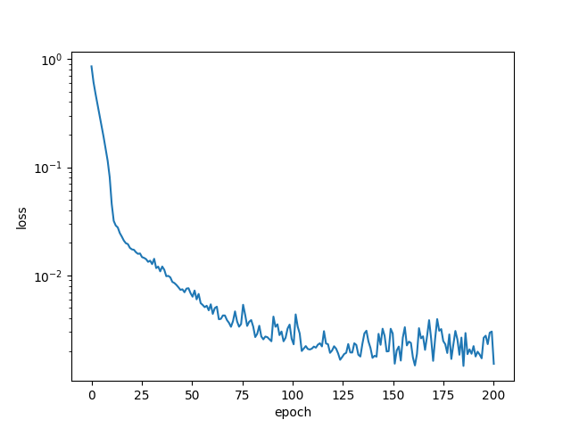

### End to end time series prediction gluon code for the article:

'Conditional Time Series Forecasting with Convolutional Neural Networks'

https://arxiv.org/abs/1703.04691

and

'Lorenz Trajectories Prediction: Travel Through Time'.
https://arxiv.org/abs/1903.07768

Plotting two of the three trajectories (z vs x) gives rise to the Lorenz butterfly.


### Training and inference

Model achieves on average the test RMSE reported in https://arxiv.org/abs/1703.04691): 

###### default setting
```
python main.py
``` 

### Learning for Conditional model for x series one step ahead prediction:



### Predictions vs ground truth for x trajectory:


