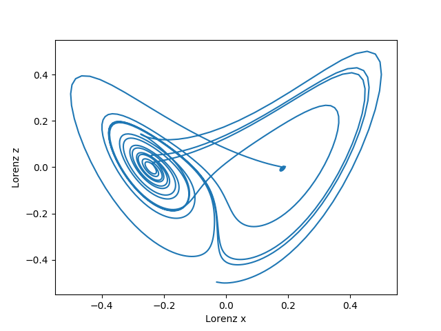
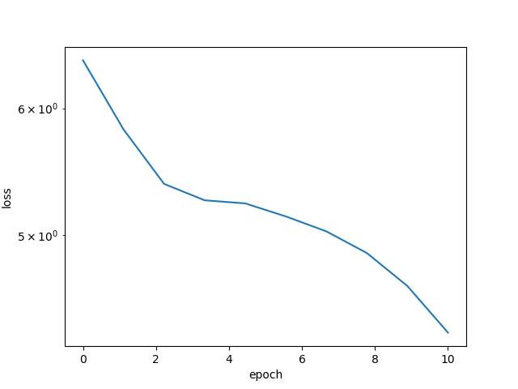
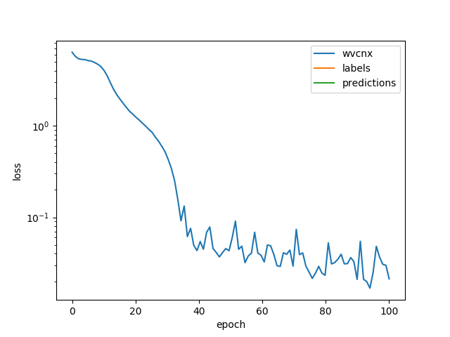

# End to end time series prediction gluon code for the article \'Lorenz Map Prediction: Travel Through Time'.

A first draft of the article is at:
![assets]

Plotting two of the three trajectories (z vs x) gives rise to the Lorenz butterfly.

# Training and inference

To run code with default parameters (conditional Wavenet architecture runs in 24 seconds end to end and achieves 5 fold better test RMSE than state of the art reported in https://arxiv.org/abs/1703.04691): 

python main.py

Additional models:
- unconditional WaveNet: python main.py --model='w'
- conditional LSTM: python main.py --model='clstm'
- uncondtional LSTM: python main.py --model='lstm'

The LSTM model also achieves and surpasses in some cases the benchmark reported in https://arxiv.org/abs/1703.04691).

# Learning for Conditional Wavenet x series one step ahead prediction:

# Predictions vs ground truth for x trajectory:

